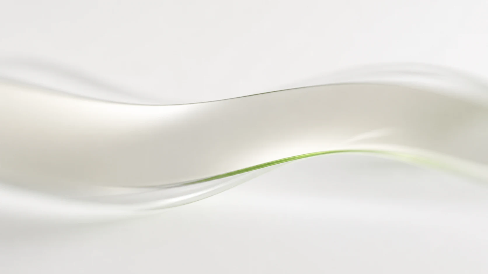

# Soft Optics Shader

Progressive viewport-edge blur, refraction, and restrained color dispersion for
the web. Soft Optics renders two overscanned optical fields over the physical
top and bottom of the viewport, responds to scroll velocity, and leaves the
middle of the page untouched.

[Live demo](https://blvdesign.github.io/SoftOpticsShader/) ·
[Vanilla example](./examples/vanilla-vite) ·
[React example](./examples/react-vite) ·
[Architecture](./docs/architecture.md)



The demo artwork and motion are original project assets. Prompts, derivatives,
and the video production command are recorded in
[demo media provenance](./apps/demo/public/media/README.md).

## What it does

- Uses WebGL2 for continuous separable blur, displacement, and RGB sampling.
- Processes the outermost viewport pixel without exposing an unblurred seam.
- Increases the optical response with scroll speed, then holds and decays it.
- Supports top, bottom, or both edges.
- Keeps selected UI—such as fixed navigation—outside the captured texture.
- Can composite explicitly opted-in, currently playing video frames without
  pausing or replacing the source `<video>`.
- Falls back to one smoothly masked `backdrop-filter` layer per edge.
- Imports safely in SSR environments and releases all owned resources.

The framework-agnostic core is `@blvdesign/soft-optics`. The React package is a
thin lifecycle adapter and has React 19 peer dependencies.

## Installation

Vanilla, Vue, Svelte, or another browser runtime:

```sh
pnpm add @blvdesign/soft-optics
```

React 19:

```sh
pnpm add @blvdesign/soft-optics @blvdesign/soft-optics-react
```

The packages require Node.js 20.19 or newer for tooling and package
consumption. The runtime itself is browser-only after `mount()`.

## Vanilla

```ts
import {
  createSoftOptics,
  type SoftOpticsStatus
} from "@blvdesign/soft-optics";

const optics = createSoftOptics({
  root: document.body,
  exclude: "[data-soft-optics-ignore]",
  layer: {
    parent: document.body,
    zIndex: 40
  },
  onStatusChange(status: SoftOpticsStatus) {
    console.log(status.mode);
  }
});

await optics.mount();

// Partial updates merge into the controller's current resolved config.
optics.update({ maxBlur: 24, refraction: 2 });
await optics.refresh();
optics.setEnabled(false);

// Call during route disposal or app teardown.
optics.destroy();
```

`createSoftOptics()` reads no browser globals. `mount()` uses `options.root` or
`document.body`, creates the edge canvases, captures the page, and resolves
after the initial capture path has completed. Calling `mount()` more than once
returns the same in-flight/completed promise. Calling methods after `destroy()`
is safe and has no effect.

### Controller options

| Option | Type | Default | Behavior |
| --- | --- | --- | --- |
| `root` | `HTMLElement` | `document.body` | Element mirrored into the static document texture. |
| `config` | `Partial<SoftOpticsConfig>` | default config | Overrides are validated and clamped. |
| `exclude` | CSS selector or `(node: Node) => boolean` | none | Matching nodes are omitted from capture; mutations wholly inside those subtrees do not refresh capture. |
| `layer.parent` | `HTMLElement` | `document.body` | Parent for fixed optical canvases or fallback layers. |
| `layer.zIndex` | `number` | `40` | Rounded finite stacking value. |
| `allowLiveVideo` | `boolean` or video predicate | attribute opt-in | Overrides which videos may attempt live compositing; safety checks still apply. |
| `onStatusChange` | status callback | none | Receives lifecycle and fallback transitions. Callback errors are isolated. |

### Controller methods

| Method | Contract |
| --- | --- |
| `mount(): Promise<void>` | Starts lifecycle observers and the initial render/fallback path. |
| `update(partial)` | Merges and resolves config. Edge topology changes rebuild edge resources. |
| `refresh(): Promise<void>` | Requests a debounced static recapture. Concurrent requests are coalesced; an invalidation during capture schedules one follow-up. It is a no-op while disabled, destroyed, or in fallback. |
| `setEnabled(enabled)` | Hides/re-enables owned layers and resets motion when disabled. |
| `getStatus()` | Returns the current `SoftOpticsStatus`. |
| `destroy()` | Idempotently removes listeners, observers, RAF work, layers, capture work, and WebGL resources. |

Statuses are `loading`, `webgl`, `fallback`, or `disabled`. See
[troubleshooting](./docs/troubleshooting.md#status-and-fallback-reasons) for
every reason.

## React

```tsx
import { SoftOptics } from "@blvdesign/soft-optics-react";

export function App() {
  return (
    <>
      <header data-soft-optics-ignore style={{ zIndex: 50 }}>
        Navigation stays sharp
      </header>
      <main>Long, scrollable content</main>
      <SoftOptics
        preset="default"
        exclude="[data-soft-optics-ignore]"
        layer={{ zIndex: 40 }}
      />
    </>
  );
}
```

`<SoftOptics />` renders `null`. It creates the core controller in an effect,
updates config without recreating the controller, and destroys it on unmount.
It is safe under React Strict Mode and during server rendering.

For imperative access, use the hook:

```tsx
import { useSoftOptics } from "@blvdesign/soft-optics-react";

export function OpticsLifecycle() {
  const controllerRef = useSoftOptics({
    preset: "subtle",
    config: { maxBlur: 18 }
  });

  return (
    <button onClick={() => void controllerRef.current?.refresh()}>
      Refresh capture
    </button>
  );
}
```

React supports `preset="default" | "subtle"`. The selected preset is applied
first, then `config` wins key by key. Changing `root`, `exclude`, `layer`, or
`allowLiveVideo` recreates the controller because those are creation-time
options. Changing `preset` or `config` calls `controller.update()`.

The core package does not accept a `preset` option. Use
`SOFT_OPTICS_PRESETS.subtle` explicitly when constructing a core config:

```ts
import {
  createSoftOptics,
  SOFT_OPTICS_PRESETS
} from "@blvdesign/soft-optics";

const optics = createSoftOptics({
  config: {
    ...SOFT_OPTICS_PRESETS.subtle,
    refraction: 1
  }
});
```

## Configuration

All numeric input is finite-checked and clamped. `resolveConfig()` returns a
new frozen config; its `edges` array is frozen as well. Invalid or empty edge
lists resolve to both edges, and duplicates are removed.
`SOFT_OPTICS_CONFIG_RANGES` exports the numeric bounds below.

| Property | Type | Default | Units | Accepted range | Behavior |
| --- | --- | --- | --- | --- | --- |
| `enabled` | boolean | `true` | boolean | boolean | Starts or hides the effect. |
| `edges` | edge array | `["top", "bottom"]` | top \| bottom | top \| bottom | Selects one or both independent edge renderers. |
| `edgeHeight` | number | `7` | vh | 0–20 | Primary optical zone height. |
| `featherHeight` | number | `2` | vh | 0–10 | Additional transition area; total strip zone is `edgeHeight + featherHeight`. |
| `maxBlur` | number | `20` | CSS px | 0–64 | Blur radius used by the separable passes at the strongest edge field. |
| `refraction` | number | `3` | CSS px | 0–16 | Base directional UV displacement scale, modestly boosted by scroll impulse. |
| `chromaticAberration` | number | `2` | CSS px | 0–8 | Base separation between red, green, and blue samples, modestly boosted by scroll impulse. |
| `velocitySensitivity` | number | `1.5` | unitless divisor | 0.1–10 | Higher values require faster scrolling for the same impulse. |
| `peakHoldMs` | number | `100` | ms | 0–2,000 | Time an impulse peak is held before decay. |
| `decayMs` | number | `800` | ms | 1–10,000 | Time for exponential decay to reach approximately 5%. |
| `oppositeEdgeResponse` | number | `0.4` | coefficient | 0–1 | Share of impulse applied to the edge opposite scroll direction. |
| `edgeFadeDistance` | number | `36` | CSS px of document scroll | 1–10,000 | Distance from a document boundary over which edge presence reaches full strength. |
| `presenceFloor` | number | `0.68` | coefficient | 0–1 | Minimum strength at the start/end of the document. |

The built-in `subtle` preset uses:

```ts
{
  enabled: true,
  edges: ["top", "bottom"],
  edgeHeight: 5,
  featherHeight: 2,
  maxBlur: 16,
  refraction: 0.5,
  chromaticAberration: 0.22,
  velocitySensitivity: 0.75,
  peakHoldMs: 70,
  decayMs: 650,
  oppositeEdgeResponse: 0.3,
  edgeFadeDistance: 48,
  presenceFloor: 0.56
}
```

## Exclusion and layering

The compositor uses fixed, `pointer-events: none` layers. To keep navigation or
controls visually sharp, exclude them from capture and place them above the
optical layer:

```html
<nav data-soft-optics-ignore class="navigation">…</nav>
```

```css
.navigation {
  position: fixed;
  z-index: 50;
}
```

```ts
createSoftOptics({
  exclude: "[data-soft-optics-ignore]",
  layer: { zIndex: 40 }
});
```

Exclusion affects the mirrored capture, not the real DOM. A selector matches
elements; a predicate can also exclude non-element nodes. Invalid selectors and
predicate exceptions are treated as “exclude nothing” for the affected node.
Internal compositor nodes are always excluded. The mutation observer watches
attributes, text, and child-list changes across `root`; changes entirely inside
an excluded or internal subtree are ignored.

## Dynamic content and refresh

The controller listens for scroll, wheel, viewport resize, image loads, and
video lifecycle events. A `ResizeObserver` refreshes when the root's scroll
dimensions change. A debounced `MutationObserver` refreshes meaningful DOM
changes. If either observer API is unavailable, the controller still works;
call `refresh()` after layout or content changes that alter the static page.

Font readiness is bounded so it cannot indefinitely delay the first frame. If
fonts are still pending, the first capture proceeds and one refresh is scheduled
after `document.fonts.ready`.

## Live video

Videos are excluded from the static mirror and represented by their poster (or
an inert placeholder). The original element is never paused, replaced, hidden,
or seeked.

Live compositing is opt-in:

```html
<video
  data-soft-optics-live
  muted
  autoplay
  loop
  playsinline
  src="/media/loop.webm"
></video>
```

Alternatively set `allowLiveVideo: true` or return `true` from a predicate.
Opt-in is permission to attempt compositing, not a bypass. The current frame
must be ready, drawable without tainting a canvas, visible, opaque through its
ancestor chain, and topmost at sampled hit-test points. Transforms, filters,
backdrop filters, masks, clip paths, perspective, blend modes, and fractional
ancestor opacity conservatively disable live compositing. `object-fit`,
`object-position`, rounded corners, and overflow clips are reproduced for safe
frames.

If a video is not safe, playback continues normally but the optical layer uses
its static poster/placeholder in that area. Iframes, objects, and embeds are
also inert placeholders; their live contents are not captured.

## CORS and capture budgets

Page capture uses a hidden, inert mirror and `modern-screenshot`. Images,
fonts, CSS background images, posters, and videos used in a canvas must be
same-origin or return suitable CORS headers. A tainted or unreadable canvas
enters fallback rather than breaking the page.

The default capture budget is 16,384 physical pixels on either axis and
64,000,000 total pixels. Device pixel ratio is capped at 2. These limits avoid
oversized canvases and GPU uploads. The lower-level exported `captureRoot()`
accepts smaller `captureLimits`; the controller intentionally does not expose a
capture-budget option in v0.1.0.

A custom `root` can reduce the amount of DOM content cloned and rasterized, but
it does not reduce the document-sized physical canvas or its capture-budget calculation
in v0.1.0. For `capture-too-large`, shorten or paginate the document, use a
lower `pixelRatio` only when calling the lower-level `captureRoot()` directly,
or accept fallback. The controller exposes neither capture DPR nor budget
overrides. The root capture uses a white background in v0.1.0.

## Fallback and reduced motion

The primary path requires WebGL2 and a readable page capture. Initialization,
allocation, upload, source-size, context-loss, capture, or security failures
attempt the CSS fallback. `prefers-reduced-motion: reduce` also selects the
fallback before WebGL setup.

The fallback uses one continuous masked `backdrop-filter: blur()` layer per
edge. It preserves progressive softness, but it does **not** reproduce WebGL
refraction or RGB dispersion. If backdrop filtering is unavailable, the
controller reports `disabled` and leaves the page unchanged.

Reduced motion disables scroll impulse; it does not force the entire page to
stop animating and does not mutate source videos. See
[browser support](./docs/browser-support.md).

## Performance

- Keep `root` focused to reduce clone/content complexity, while remembering
  that v0.1 still allocates a document-sized capture canvas.
- Prefer same-origin, already-decoded images and fonts.
- Opt only simple, topmost videos into live compositing.
- Call `refresh()` after batches of DOM changes rather than after every write.
- Avoid rapidly changing `root`, `exclude`, `layer`, or `allowLiveVideo` in
  React; those options intentionally recreate the controller.
- Use the `subtle` preset for lower optical displacement—not as a promise of a
  smaller static capture.
- Always call `destroy()` outside React; the adapter handles this automatically.

## Browser support

The WebGL path is continuously tested in Chromium. Other current browsers can
run it when WebGL2, canvas readback, and the required DOM APIs are available,
but GPU and capture differences are expected. See the exact support matrix and
fallback notes in [browser support](./docs/browser-support.md).

## Troubleshooting

Start with `onStatusChange` or `getStatus()`. Common causes are CORS-tainted
media, capture budgets, reduced motion, disabled WebGL2, or a video that fails
the conservative compositing checks. The complete diagnostic guide is in
[troubleshooting](./docs/troubleshooting.md).

## Repository

Requires Node.js 20.19+ and pnpm 10:

```sh
corepack enable
pnpm install
pnpm check
```

Run the editorial demo with `pnpm dev`. `pnpm test:pack` builds both packages,
checks the exact tarball allowlist and dependency metadata, installs those
tarballs into isolated copies of both examples, builds the consumers, and
probes ESM and CommonJS SSR imports.

See [CONTRIBUTING.md](./CONTRIBUTING.md), the
[architecture](./docs/architecture.md), and the
[changelog](./CHANGELOG.md).

### Release process

User-facing changes include a Changeset (`pnpm changeset`). Maintainers run
`pnpm changeset version`, review package/changelog output, and require
`pnpm check` before the protected release workflow publishes. npm credentials
belong in repository/trusted-publishing configuration, never source files.

## License

Soft Optics Shader is released under the [MIT License](./LICENSE).
